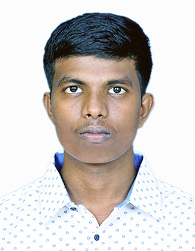

### **Gowtham Karaka**

---

---

**Contact Information:**

- **Email:** gkgowthamk@gmail.com
- **LinkedIn:** [linkedin.com/in/gowtham-karaka](https://www.linkedin.com/in/gowtham-karaka-192b64151/)

---

### **Education**

**Master of Professional Studies (M.P.S) in Data Science**  
_University of Maryland, Baltimore County_  
_Expected Graduation: December 2024_  
_GPA: 3.90/4.00_

**Bachelor of Technology (B.Tech.) in Electrical and Electronics Engineering**  
_Vignan's Institute of Information Technology, Visakhapatnam, India_  
_Graduated: July 2021_  
_GPA: 3.70/4.00_

---

### **Technical Skills**

- **Programming Languages:** Python, R, C, SQL
- **Tools & Frameworks:** MATLAB, Scikit-learn, Apache Spark, Tableau, Microsoft Power BI, MS Office Suite
- **Data Science:** Data Analysis, Machine Learning, Data Visualization, Big Data Processing, Data Management.

---

### **Work Experience**

**Systems Engineer**  
_Infosys McCamish_  
_December 2021 - January 2023_

- Developed and maintained enterprise-level software systems for the insurance industry.
- Collaborated with cross-functional teams to enhance system efficiency and reliability.
- Automated data processing tasks, reducing manual effort by 30%.

**Digital Media Intern**  
_DataBeat_  
_June 2020 - August 2020_

- Assisted in data collection, cleaning, and preprocessing for client projects.
- Conducted exploratory data analysis and developed predictive models using Python and R.
- Presented findings to senior management, leading to data-driven decision-making.

---

### **Projects**

**Maryland Vehicle Crash Analysis**  
_University of Maryland, Baltimore County_

- Analyzed Maryland vehicle crash data using Apache Spark and Python.
- Identified key factors contributing to accidents and provided insights for public safety improvements.

---

### **Extracurricular Activities**

- **Peer Health Educator** – Organized workshops to promote mental health awareness on campus.
- **Math Tutor** – Provided one-on-one tutoring for high school students in math and science subjects.

---

### **Achievements**

- **Chess Tournaments:**
  - UMBC Open (2023)
  - BEL AIR Open (2023)
  - Washington Chess Congress (2023)
  - ICC Continental Chess (2023)

---
